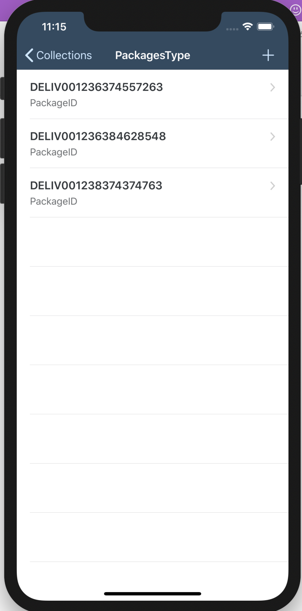

# MyDeliveries2 
From SAP Developers Mission https://developers.sap.com/mission.sdk-ios-app-create.html

This applicaiton enables display of Deliveries of packages with delivery status, package progress and wait time at each stop, and a map plotting the package.

Create Your First iOS Application with the SAP Cloud Platform SDK for iOS

Essentially - An OData service backend on SCP Neo with a Fiori in iOS app front-end using XCode.
It includes controllers for table, charts, Fiori timeline cell elements, a map with annotations. 

MyDeliveries2 Images:

# Generated by the SAP Cloud Platform SDK for iOS Assistant

## This App Project
This project can be used as-is. The source code is not protected by any license and can freely be used without restrictions, just like sample source code on our help pages.
More information about the structure of the generated application can be found on [help.sap.com](https://help.sap.com/viewer/fc1a59c210d848babfb3f758a6f55cb1/3.1/en-US/c14683672e9d4df383e8fced4ea9a019.html).

## Tutorials
Check out these tutorials and courses for deep-dives into various areas
* [Mobile Interactive Tutorials](https://www.sap.com/developer/tutorial-navigator/mobile-interactive-tutorials.html)
* [Community Tutorials](https://www.sap.com/developer/topics/cloud-platform-sdk-for-ios.html)
* [openSAP course](https://open.sap.com/courses/ios2)

## TechEd
Watch SAP TechEd sessions on mobility online at [SAP Teched Online](http://www.sapteched.com/online).
